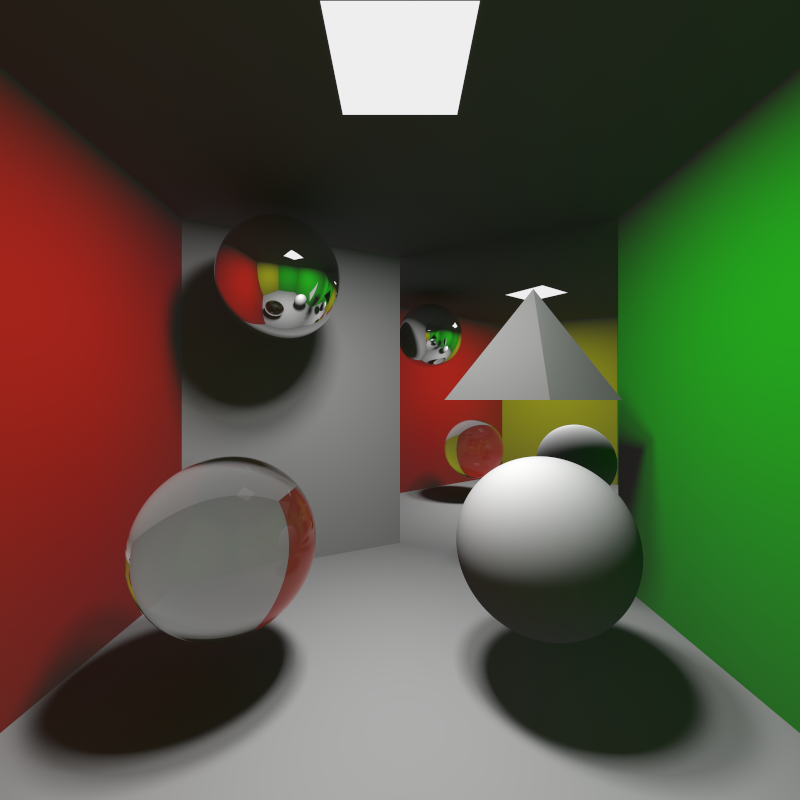

# Monte Carlo Ray Tracer

A Monte Carlo Ray tracer that renders still images of 3D scenes using the Monte Carlo integration algorithm.

The ray tracer calculates intersections, direct lighting, indirect lighting and colorbleeding, diffuse materials, perfectly reflecting materials and transparent materials to render the scene. Uses super sampling and ray randomization. The rendering process uses simple parallelization with openMP.

The project was made as a part of the course TNCG15 - Advanced Global Illumination and Rendering.

Developed by [Johan Linder](https://github.com/linderjohan) and [Oscar Olsson](https://github.com/ozcarolsson)

Rendered image with 400 samples per pixel:

<div>
	
</div>

Works for objects with one of the following material properties:

- Transparent objects
- Lambertian reflectors
- Oren Nayar reflectors
- Perfect reflector (mirror)

## How to run

```shell
#Compile
make
#Run binary
./bin/mc-raytracer
```

Modify _main.cpp_ to change the number of samples per pixel.
